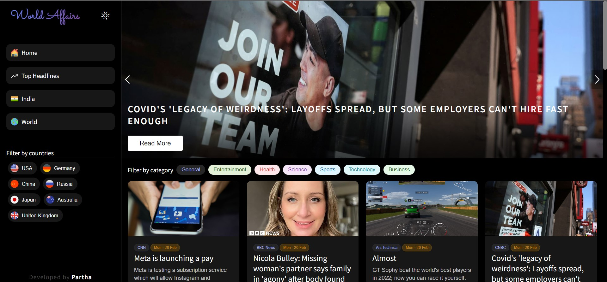
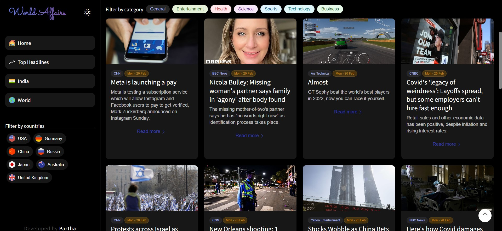

# WORLD AFFAIRS
### It contains all the news and events that are happening in the world.
<br>

## Contributors

- [Partha](https://www.github.com/partha7978)
<br><br>

## Screenshots
  / create a screenshot table for the project

  ### Light Mode

| Home Page | Home Page Card Layout | News Card |
| :---: | :---: | :---: |
|  |  |  |

<br>

### Dark Mode

| Home Page | Home Page Card Layout | News Card |
| :---: | :---: | :---: |
|  |  |  |

<br>


## Installation

Install world affairs on your local machine

```bash
  git clone https://github.com/partha7978/world-affairs.git

  cd world-affairs
```

### After installing on your local machine, you have to install all the packages that are used in this project.

```bash
  npm install
``` 

### To run this project on your local machine

```bash
  npm start
```

## Tech Stack

* HTML
* CSS
* JavaScript
* React
* Material UI
* News API
* HeroIcons
* React Slideshow Image
* React Infinity Scroll
* React Router
* React Top Loding bar


### Contributions are welcome. Please open an issue or a pull request on  [GitHub](https://github.com/partha7978/world-affairs)

<br> 

## Copyright (c) 2022 <a href="https://parthasarathimuduli.netlify.app/" target="_self">Partha Sarathi Muduli</a>